# h7 Tehtävä

x) Lue ja tiivistä. Tiivistelmäksi riittää muutama ranskalainen viiva per artikkeli. (Tässä alakohdassa ei tarvitse tehdä testejä tietokoneella)
Karvinen 2012: First Steps on a New Virtual Private Server – an Example on DigitalOcean and Ubuntu 16.04 LTS
a) Vuokraa oma virtuaalipalvelin haluamaltasi palveluntarjoajalta. (Vaihtoehtona voit käyttää ilmaista kokeilujaksoa, GitHub Education krediittejä; tai jos mikään muu ei onnistu, voit kokeilla vagran:tia paikallisesti).
b) Tee alkutoimet omalla virtuaalipalvelimellasi: tulimuuri päälle, root-tunnus kiinni, ohjelmien päivitys.
c) Asenna weppipalvelin omalle virtuaalipalvelimellesi. Korvaa testisivu. Kokeile, että se näkyy julkisesti. (Muista tehdä reikä tulimuuriin).
d) Etsi merkkejä murtautumisyrityksistä.

## x)

## a)

- Aloitin vuokraamalla oman virtuaalipalvelimen Linodelta. Rekisteröidyin sivulle, kävin vaadittavat vaiheet läpi, jonka jälkeen pääsin luomaan palvelimen. Valitsin halvimman mahdollisen version (5$/kk), jossa on 1 GB RAM:ia. Serverin sijainnin valitsin Saksaan. Alla kuva vielä luomani virtuaalipalvelimen yhteenvedosta

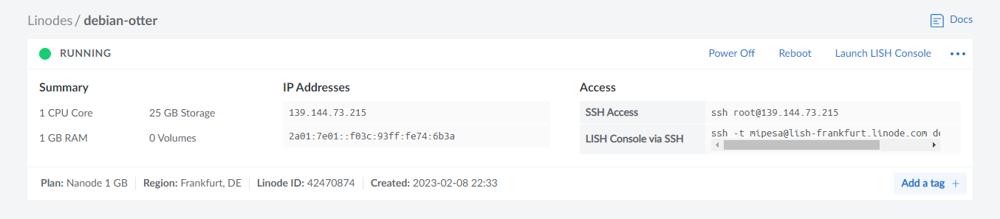

## b)

Siirryin hallinnoimaan virtuaalipalvelinta virtuaalikoneelleni komentokehotteen kautta komennolla: 

    $ ssh root@'ip_osoite'
    
- Suoritin komentokehotteessa komennon ``$ sudo apt-get update``, joka tarjoaa saatavilla olevat pävitykset. Sen jälkeen asensin päivitykset, sekä samalla palomuurin komennolla ``$ sudo apt-get install ufw`` 
- Tein ensin reiän SSH varten portille 22 komennolla ``$ sudo ufw allow 22/tcp``, jonka jälkeen pistin palomuurin päälle komennolla ``sudo ufw enable``

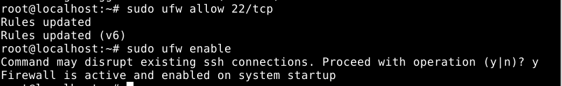

- Tein uuden käyttäjän root käyttäjän tilalle. Aloitin uuden käyttäjän tekemisen komennolla ``$ sudo adduser miikka``, syötin salasanan käyttäjälle ja ``Full Name:`` kohtaan syötin nimeni. Muut kohdat jätin tyhjäksi painamalla ``Enter``. 
- Annoin juuri luomalleni käyttäjälle sudo käyttäjän oikeudet komennolla ``sudo adduser miikka sudo``. Lähdin testaamaan toimiiko juuri luomani käyttäjä ja sudo komennot enne root käyttäjän lukitsemista.
- Avasin uuden komentokehotteen ja kirjauduin käyttäjälläni virtuaalipalvelimelle komennolla ``$ ssh miikka@'ip_osoite'``. Syötin salasanan ja pääsin sisään.

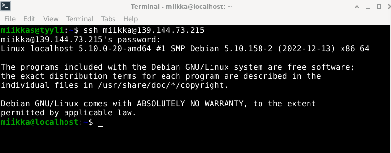

- Testasin sudo komennon käyttöä päivittämällä ohjelmat uudestaan komennolla ``$ sudo apt-get update`` ja sen perään ``$ sudo apt-get upgrade``. Komennot toimivat ja päivitys onnistui, joten sudo toimii "miikka" käyttäjällä.
- Lukitsin root käyttäjän komennolla ``$ sudo usermod --lock root`` Tämä lukitsee root käyttäjän salasanan. Kävin myös ottamassa root kirjautumisen pois päältä ``sshd_config`` tiedostosta

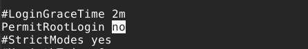

- Testasin onnistuiko root käyttäjän lukitseminen, yrittämällä kirjautua uudestaan virtuaalipalvelimelle root käyttäjällä. 

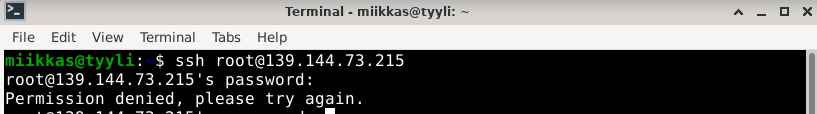

- Root käyttäjän lukitseminen onnistui.

## c)

- Ennen apache2 asennusta avasin reiän portille 80 komennolla ``$ sudo ufw allow 80/tcp``
- Asensin apache2 komennolla `` $ sudo apt-get install apache2``
- Verkkosivuni avaa apache2 esimerkkisivun.

- Laitoin micron default editoriksi .bashrc tiedostoon. Kirjoitin ``export EDITOR='micro'`` ``.bashcr`` tiedoston loppuun, jonka jälkeen otin muutoksen käyttöön komennolla ``source .bashrc``. 
- Loin uuden .conf tiedoston uudelle etusivulle apache2 ``sites-available`` kansioon komennolla ``$ sudoedit /etc/apache2/sites-available/frontpage.conf``

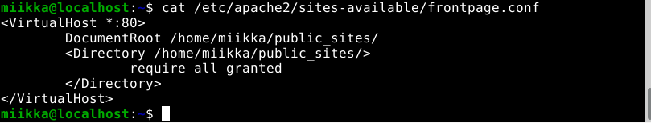

- Otin käyttöön uuden luomani etusivun komennolla `` $ sudo a2ensite frontpage.conf`` ja otin vanhan etusivun pois käytöstä komennolla ``$ sudo a2dissite 000-default.conf``. Tämän jälkeen boottasin apache2 serverin komennolla ``$ sudo systemctl restart apache2``.
- Jotta juuri ``frontpage.conf`` tiedostoon syöttämäni tiedostopolku toimisi loin kotihakemistoon uuden ``public_sites`` kansion. Siirryin kotihakemistoon ``$ cd`` ja tarkistin polun ``$ pwd``. Tein kansion komennolla ``$ mkdir public_sites``.
- Siirryin kansioon ``$ cd public_sites/``. Kansioon tein ``index.html`` tiedoston micro editorilla, johon uuden etusivun koodi tulee. Komento: ``$ micro index.html`` 

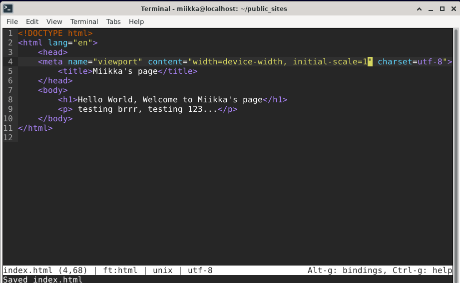

- Testasin uuden etusivun toimivuutta komentokehotteess ``$ curl 'ip_osoite'``.
- Komentokehote vastasi uudella etusivulla:

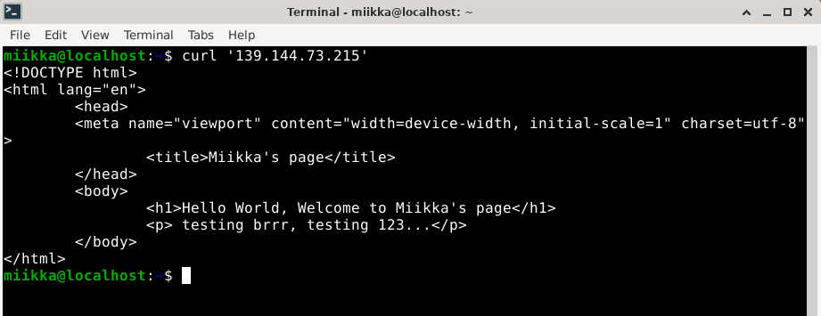

Testasin vielä toisella laitteella verkkoselaimella:

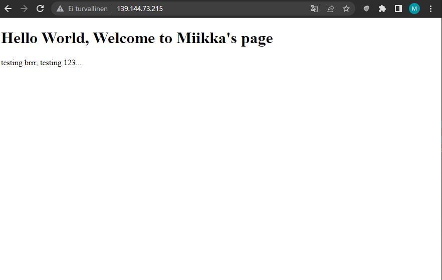

- Uusi etusivuni on nyt siis virtuaalipalvelimella kaikkien nähtävissä: http://139.144.73.215/

## d)

Etsin merkkejä ``auth.log`` lokista murtautumisyrityksistä komennolla ``$ sudo tail -50 /var/log/auth.log``. Yllätyin, kuinka vilkasta lokissa oli. Lokista löytyi lukuisia kirjautumisyrityksiä eri IP osoitteista. Katsoin myös reaaliajassa, kun lokiin tuli kirjautumisyrityksiä komennolla ``$ sudo tail -F /var/log/auth.log``

- Alla olevassa näyttökuvassa user "nathaniel" yritti epäonnistuneesti kirjautua sisään virtuaalipalvelimelle.
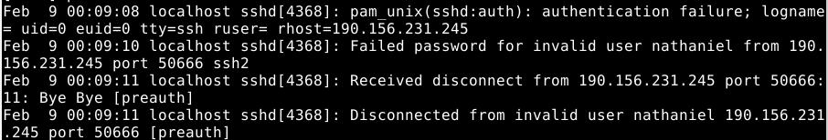

- Tässä tapahtumassa "root" käyttäjälle yritettiin kirjautua useita kertoja, joka johti erroriin liian monen epäonnistuneen yrityksen takia. Tämä voisi viitata mahdollisesti brute-force menetelmään? Eli hyökkäykseen, jossa yritetään järjestelmällisten yritysten avulla löytää oikea salasana. Root käyttäjän salasana on kuitenkin lukittu, joka suojaa kyseiseltä menetelmältä.
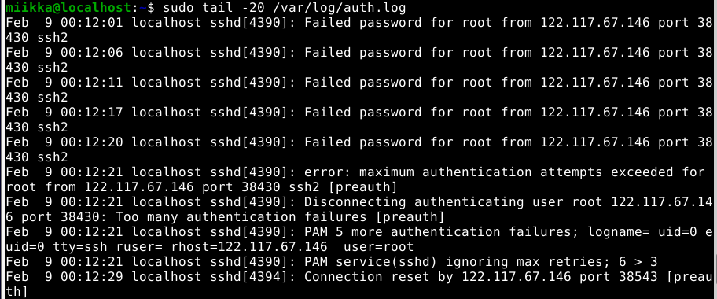

- Tässä tapahtumassa käyttäjä "abc" yritti kirjautua sisään. Epäonnistuen, sillä ei sellaista käyttäjää ole olemassa virtuaalipalvelimessani. IP osoitteesta näkee, että yrittäjä on sama, joka aikaisemmassa esimerkissä yritti sisään "nathaniel" käyttäjänimellä.
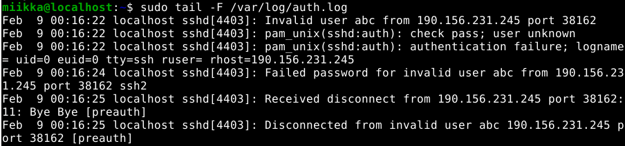

- Tässä tapahtumassa joku yritti kirjautua palvelimelle käyttäjällä "Debian"
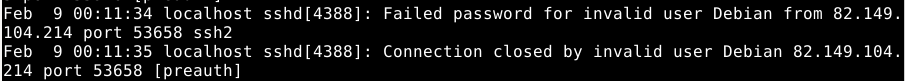

``/var/log/apache2/access.log`` lokista löysin myös murtautumisyrityksen. Etsin lokista tietoja komennolla ``sudo tail -10 /var/log/apache2/access.log``

- Tässä tapahtumassa, joku yritti IP osoitteesta ``185.246.220.98`` lähettää ``POST`` pyynnön ``/boaform/admin/formLogin`` verkkosivulleni. POST pyyntö, kuitenkin aiheutti errorin ``404``, kuten lokista näkyy. Lokista silmään tarttui myös, että pyyntö oli tehty Ubuntu käyttöjärjestelmällä Linuxilla Firefox selaimella. 
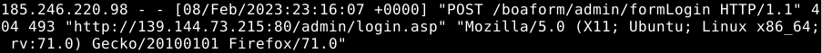
